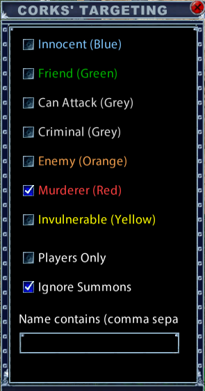
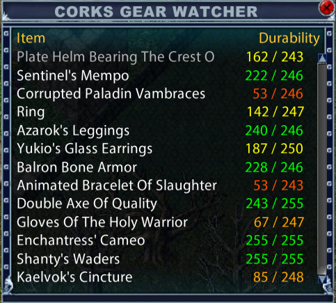

# CorksUI

Custom user interface additions for the **Ultima Online Enhanced Client**. CorksUI is built on top of the default UI and adds a notoriety-aware targeting system, an equipment durability tracker and several Map Window improvements.





## Contents

- [Installation](#installation)
- [Features](#features)
  - [Corks' Targeting](#corks-targeting)
  - [Corks' Gear Watcher (Durability)](#corks-gear-watcher-durability)
  - [Map Window Changes](#map-window-changes)
- [Actions Reference](#actions-reference)
- [Saved Settings](#saved-settings)
- [File Layout](#file-layout)
- [Development Notes](#development-notes)

## Installation

1. Copy the `CorksUI` folder into your client's `UserInterface` folder, for example:
   `C:\...\Ultima Online Enhanced\UserInterface\CorksUI`
2. Start the client, open **Options → Interface**, and select **CorksUI** as the custom UI.

## Features

### Corks' Targeting

A configurable replacement for the Target Next, Nearest and Previous hotkeys. It only cycles through mobiles that pass the filters you pick.

**Opening the window:** Actions → **Targeting** → **Corks' Targeting**. Drag it to a hotbar to toggle the settings window.

#### Filters

| Filter | What it does |
| --- | --- |
| Notoriety checkboxes | Choose which notorieties can be targeted: Innocent (Blue), Friend (Green), Can Attack (Grey), Criminal (Grey), Enemy (Orange), Murderer (Red), Invulnerable (Yellow). Each label is shown in its notoriety color. |
| Players Only | Skips pets, known creatures/NPCs (from the creature database) and invulnerable NPCs such as vendors, guards and healers. |
| Ignore Summons | Skips summoned creatures. |
| Name contains | Only targets mobiles whose name contains one of the words you type. Separate several with commas, e.g. `orc, lich, dragon`. Matching ignores case and matches part of a name (`lich` also matches "lich lord"). Leave it empty to turn it off. Press **Enter** to apply. |

All filters work together: a mobile has to pass every enabled filter to be targeted. You are never targeted yourself, and nothing 22 or more tiles away is considered.

#### Targeting actions

Found under Actions → Targeting. Drag them to a hotbar or bind them to keys.

- **Target Nearest (Notoriety)**: the closest mobile that passes the filters.
- **Target Next (Notoriety)**: steps forward through the mobiles on screen, wrapping around at the end.
- **Target Previous (Notoriety)**: goes back through your target history, skipping any that no longer pass the filters.

Selecting a target this way does not pop up the context menu.

**Window controls:** right-click to close; use the mouse wheel over the window to scale it. It snaps to other windows and remembers its position.

### Corks' Gear Watcher (Durability)

A compact window that lists every equipped item that has durability, with its current and maximum value.

**Opening the window:** Actions → **Equipment** → **Corks' Gear Watcher**.

- It updates when your paperdoll changes and also refreshes every 10 seconds.
- The window resizes to fit the number of items.
- The durability value is colored by how much is left:

  | Remaining | Color |
  | --- | --- |
  | Over 75% | Green |
  | 51–75% | Yellow |
  | 26–50% | Orange |
  | 11–25% | Dark orange |
  | 10% or less | Red |

- If nothing you're wearing has durability, it shows "No items with durability equipped."

**Window controls:** right-click to close; use the mouse wheel to scale it. It remembers its position and scale.

### Map Window Changes

`Source/MapWindow.lua` replaces the default Map Window with these changes:

- **Player position logging:** your facet and X/Y coordinates are written to `logs/pos.log` while the map updates, for use by external mapping tools.
- **Map title** "Atlas" is shown again.
- **Dragging is kept within the map's borders**, so you can't drag the view off the edge of the map.
- **Zoom:** your saved zoom level is restored when the map opens, with an adjusted default if none is saved.
- The combo box, lock and tilt settings are saved between sessions.

## Actions Reference

Custom actions use IDs **6100–6149** in `Source/ActionsWindow.lua`.

| ID | Name | Group | Script |
| --- | --- | --- | --- |
| 6100 | Target Nearest (Notoriety) | Targeting | `CorksTargeting.NearTarget()` |
| 6101 | Target Next (Notoriety) | Targeting | `CorksTargeting.NextTarget()` |
| 6102 | Target Previous (Notoriety) | Targeting | `CorksTargeting.PrevTarget()` |
| 6103 | Corks' Targeting | Targeting | `CorksTargeting.Toggle()` |
| 6104 | Corks' Gear Watcher | Equipment | `CorksDurabilityGump.Toggle()` |

You can also run any of these from a macro or the chat line with `/script <function>`.

## Saved Settings

Settings are stored in the client's normal interface settings, so each character keeps its own.

| Setting | Feature |
| --- | --- |
| `CorksTargetingNoto2` – `CorksTargetingNoto8` | Notoriety checkboxes |
| `CorksTargetingPlayersOnly` | Players Only |
| `CorksTargetingIgnoreSummons` | Ignore Summons |
| `CorksTargetingNameFilter` | Name filter text |
| `MapZoom`, `MapWindowLocked`, `ShowMapCombos`, `MapWindowTilt` | Map Window |

Window positions and scales are saved through the standard `WindowUtils` helpers.

## File Layout

```text
CorksUI/
├── Interface.xml              Loads all UI files, including the Corks additions
├── Interface.lua              Creates CorksTargetingWindow and CorksDurabilityGump at startup
└── Source/
    ├── ActionsWindow.lua      Adds the custom actions (IDs 6100–6104) to the Actions menu
    ├── CorksTargeting.lua     Targeting filters and Next/Nearest/Previous logic
    ├── CorksTargeting.xml     Targeting settings window
    ├── CorksDurabilityGump.lua  Gear Watcher logic
    ├── CorksDurabilityGump.xml  Gear Watcher window (19 rows defined up front)
    └── MapWindow.lua          Map Window changes
```

Files that aren't in this folder load from the default UI.

## Development Notes

A few things about the client's Lua environment that come up when working on this UI:

- **Strings vs. wide strings:** `type()` returns `"string"` for both plain strings and wide strings (`L"..."`), so it can't tell them apart. `CorksTargeting.ToWString()` checks with `wstring.len` instead. Use the `wstring.*` functions on names and text-box contents.
- **Window scaling:** calling `WindowSetDimensions` on a child of a window that isn't at 1.0 scale resets the scale of windows created at runtime with `CreateWindowFromTemplate`. That's why the Gear Watcher's rows are defined in XML rather than created from Lua.
- **Keep new features from breaking old ones:** set up the existing controls first, and wrap optional code in `pcall`, so one failing feature can't leave a window empty. Corks' Targeting reports name-filter errors in the chat window.
- **Lua error logging** is off by default in the client, so `logs/lua.log` is usually empty.
